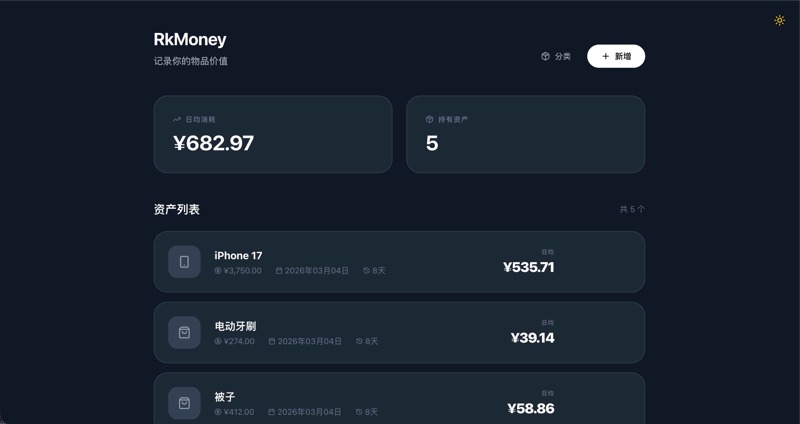

# 🪙 rkmoney

<p align="center">
  
  
  
</p>

> 资产价值管理应用 - 帮助你追踪和管理个人资产的价值消耗

<p align="center">
  <a href="#-快速开始">快速开始</a> •
  <a href="#-核心功能">核心功能</a> •
  <a href="#-项目结构">项目结构</a> 
</p>

## 项目简介

rkmoney 是我想看到自己买贵重物品平摊到每天花了多少钱，与ai开发的本地应用，鉴于国内某些App售价昂贵，索性自己开发一个简单的。

## 项目界面预览


## 核心功能

- ✅ **资产添加与管理** - 支持添加资产名称、金额、类型和购买日期
- ✅ **日均价值计算** - 智能计算资产的日均价值消耗（金额/持有天数）
- ✅ **资产售出记录** - 记录售出日期和价格，自动更新日均价值
- ✅ **资产分类管理** - 支持数码、生活、理财、其他等分类
- ✅ **数据持久化** - 基于 SQLite 的数据库存储，数据安全可靠
- ✅ **响应式设计** - 完美适配桌面端和移动端

## 技术栈

### 后端
- **FastAPI** - 现代化的 Python Web 框架
- **SQLAlchemy** - Python ORM 框架
- **Pydantic** - 数据验证和设置管理
- **SQLite** - 轻量级数据库

### 前端
- **Vue 3** - 渐进式 JavaScript 框架
- **TypeScript** - JavaScript 的超集
- **Pinia** - Vue 的状态管理
- **Vue Router** - 路由管理
- **Tailwind CSS** - 原子化 CSS 框架
- **Axios** - HTTP 客户端
- **Lucide Vue Next** - 图标库
- **Day.js** - 日期处理库

## 项目结构

```
rkmoney/
├── backend/          # FastAPI 后端
│   ├── main.py       # 主应用文件，API 路由定义
│   ├── models.py     # 数据库模型（Asset, PriceRecord）
│   ├── schemas.py    # Pydantic 数据验证模型
│   ├── crud.py       # 数据库 CRUD 操作
│   ├── database.py   # 数据库连接配置
│   ├── requirements.txt
│   └── .env.example
├── frontend/         # Vue 3 前端
│   ├── src/
│   │   ├── api/      # API 请求封装
│   │   ├── store/    # Pinia 状态管理
│   │   ├── views/    # 页面组件
│   │   ├── components/ # 可复用组件
│   │   ├── types/    # TypeScript 类型定义
│   │   └── router/   # 路由配置
│   └── public/
├── 开发计划/          # 项目文档和规划
└── README.md
```

## 🚀 快速开始

### 前置要求

- Python 3.8+
- Node.js 20+
- npm 或 pnpm

### 一键启动（推荐）

项目提供了便捷的一键启动脚本，支持 Windows、macOS 和 Linux。

#### Windows

双击运行 `start.bat` 文件，脚本将自动：
- ✅ 检查 Python 和 Node.js 环境
- ✅ 创建虚拟环境并安装依赖
- ✅ 初始化数据库
- ✅ 启动后端和前端服务

#### macOS / Linux

```bash
chmod +x start.sh
./start.sh
```

脚本将自动完成所有初始化步骤并启动服务。

### 手动运行（高级用户）

#### 1. 克隆项目

```bash
git clone <repository-url>
cd rkmoney
```

#### 2. 运行后端

```bash
cd backend

# 安装依赖
pip install -r requirements.txt

# 初始化数据库
python -c "from database import engine; from models import Base; Base.metadata.create_all(bind=engine)"

# 运行开发服务器
uvicorn main:app --reload
```

后端将在 http://localhost:8000 运行

#### 3. 运行前端

```bash
cd frontend

# 安装依赖
npm install

# 运行开发服务器
npm run dev
```

前端将在 http://localhost:5173 运行

## 📖 API 文档

后端运行后访问 http://localhost:8000/docs 查看自动生成的交互式 API 文档

## 日均价值计算规则

```
日均价值 = 购买金额 / 持有天数

其中：
- 持有天数 = 当前日期 - 购买日期
- 如果当前日期 = 购买日期，持有天数 = 1
- 已售出资产：日均价值 = (购买金额 - 售出价格) / 持有天数
```

## 主要 API 端点

| 端点 | 方法 | 描述 |
|------|------|------|
| `/api/assets` | GET | 获取所有资产 |
| `/api/assets` | POST | 创建新资产 |
| `/api/assets/{id}` | GET | 获取单个资产 |
| `/api/assets/{id}` | PUT | 更新资产信息 |
| `/api/assets/{id}` | DELETE | 删除资产 |
| `/api/assets/{id}/sell` | POST | 标记资产为售出 |
| `/api/assets/{id}/prices` | POST | 添加价格记录 |
| `/api/calculate-daily-value` | POST | 计算日均价值 |

## 📝 开发计划

- [ ] 资产价格历史记录
- [ ] 资产分类统计
- [ ] 数据导出功能（Excel/CSV）
- [ ] 多设备同步
- [ ] 资产搜索和筛选
- [ ] 自定义资产类型和图标


### 数据库重置

如需重置数据库，删除 `backend/` 目录下的 `rkmoney.db` 文件后重新启动即可。

## 👨‍💻 作者

roku-liuye
